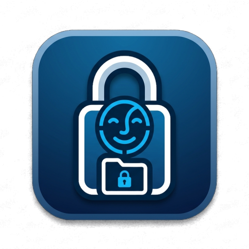

<p align="center">
  
</p>

# AppLocker

An Android-style "lock this app / hide this folder behind my face" toy for Linux.
Point a plain webcam at yourself, enroll once, and then chosen apps ask for your
face (or a PIN) before they open, an encrypted **Private** folder appears when
it's you, and files you've tucked away come back when you walk up to them.

## 🙏 Built on the shoulders of these projects

AppLocker is basically glue around a lot of excellent open-source work. Huge thanks to:

- **[OpenCV](https://opencv.org/)** + the **[OpenCV Zoo](https://github.com/opencv/opencv_zoo)** — camera capture and the face models: **YuNet** (detection) and **SFace** (recognition).
- **[gocryptfs](https://github.com/rfjakob/gocryptfs)** — the encrypted Private folder — and **[libfuse](https://github.com/libfuse/libfuse)** (FUSE) underneath it.
- **[GTK 3](https://www.gtk.org/)** with **[PyGObject](https://pygobject.gnome.org/)** and **[pycairo](https://github.com/pygtk/pycairo)** — every window and dialog.
- **[Python](https://www.python.org/)** & **[NumPy](https://numpy.org/)** — the face pipeline, watchers, and GUIs.
- **[Rust](https://www.rust-lang.org/)** (+ the [`libc`](https://github.com/rust-lang/libc) crate) — the privileged daemon, auth broker, and PAM module.
- **[Linux-PAM](https://github.com/linux-pam/linux-pam)** — the face / PIN auth tiers for sudo and the lock screen.
- **[systemd](https://systemd.io/) / logind** — services, session lock/unlock, idle — and the Linux kernel's **fanotify** (app gate) and **inotify** (hidden-file reveal).
- **[polkit](https://gitlab.freedesktop.org/polkit/polkit)** — the privilege-prompt fallback.
- **[KDE Plasma](https://kde.org/plasma-desktop/)** — PowerDevil (silent brightness), kscreenlocker (lock screen), and the theme everything follows.
- **[dbus-python](https://gitlab.freedesktop.org/dbus/dbus-python)** — talking to logind, polkit, and KDE.
- **[brightnessctl](https://github.com/Hummer12007/brightnessctl)** / **[ddcutil](https://www.ddcutil.com/)** — optional brightness backends.
- App icon generated with **Google Gemini**; built with a lot of help from **[Claude Code](https://claude.com/claude-code)** (Anthropic).

Licenses and trademarks belong to their respective projects. If I've missed crediting something, please open an issue.

> ### 🙂 What this is — and isn't
>
> This is a **fun personal project and a convenience thing, not a security
> product.** It's the phone-style lock-screen experience on a laptop: enough to
> keep a partner, a kid, a colleague, or a nosy guest out of your stuff on an
> unlocked machine. It is **not** protection against anyone with root, a live
> USB, or physical disk access — that's out of scope and always will be. Treat it
> like a curtain, not a vault. (The one genuinely-encrypted piece, the Private
> folder, is the exception — see below.)
>
> ### ⚠️ Alpha — expect breakage
>
> Early and moving fast. Targets **Kubuntu / KDE Plasma / Wayland** on a real
> webcam. Things change between builds; keep the last `.deb` around as a fallback.

## What works today

Everything here is **userspace** — no kernel modules, nothing that can wedge the
machine on a file open.

- 🔐 **Encrypted "Private" folder** — a `gocryptfs` vault in your home. Locked, it's
  an empty, unreadable directory; unlocked (after your face/PIN), your files are
  there. This is the *only* part that's actually cryptographically private, and it
  needs no root and can't freeze anything.
- 🫥 **Hidden files & folders** — pick any file/folder; it drops out of the file
  manager (via a `.hidden` list — nothing moved, nothing encrypted). Open its
  folder and a **silent face check** brings it back; lock the screen or wander off
  and it hides again. The convenient, weaker sibling of the Private folder.
- 📷 **Face unlock** on a plain webcam (YuNet detector + SFace embeddings), with a
  liveness challenge for the stronger tiers, and **PIN / sudo-password fallback**
  that can never be fully turned off (so a bad camera can't lock you out).
- 🚪 **App locking** — gate chosen `.deb`, Flatpak, AppImage, and system apps
  behind the face/PIN prompt before they launch (exec-only gate; folders use the
  vault, not a file gate, so it can't deadlock on I/O).
- 👀 **"Lock when I leave"** — while you're active the camera stays off; once idle
  it takes the occasional snapshot, and if you've gone it locks the session.
- 💡 **Auto screen-brightness** — rides the same camera to nudge brightness by
  time-of-day and room light (optional, off by default).
- 🔑 **PIN everywhere** — a root auth **broker** runs the face→PIN→sudo routine, so
  the AppLocker PIN authorises settings changes and prompts without needing your
  sudo password (replaces `pkexec`/polkit). Optional encrypted **sudo
  autocomplete** on top.
- 🎥 **One camera, shared politely** — a small priority queue
  (lockscreen ▸ app ▸ file-reveal ▸ presence) so the helpers take turns instead of
  fighting over the webcam.

**Not done yet:** face unlock for the **screen lock** (PAM `kde`) — next up, behind
its own Settings toggle. The system-wide app gate is real in the release build but
still young; test deliberately.

## Install & try

```bash
# build a package (needs cargo + dpkg-deb)
packaging/build-deb.sh                 # dev build — app gate disabled (safe)
sudo apt install ./dist/applocker_*.deb

# open the settings window
python3 /usr/lib/applocker/settings.py
```

First run walks you through models + face enrollment (or "Skip face" for PIN
only). The Private folder, hidden files, and presence features all work without
turning on the system-wide app gate.

## How it's put together

| Piece | Language | Job |
|-------|----------|-----|
| `applockerd` | **Rust** | Root daemon: the auth **broker** (Unix socket), the exec **gate** (fanotify), encrypted sudo store. Panic-isolated, self-healing systemd unit. |
| face pipeline | **Python / OpenCV** | Camera capture, enrollment (multi-angle embeddings), recognition, liveness, presence, auto-brightness. |
| vault / hide | **Python** | `gocryptfs` Private folder + the `.hidden` hide-in-place manager and its inotify face-reveal watcher. |
| GUI | **Python / GTK 3** | Settings + enrollment windows. Native GTK so it follows the KDE theme; a thin client over the daemon. |

The rule that keeps it portable: only lean on DE-neutral layers — **logind**
(`loginctl`) for lock/unlock, **PAM** for the password fallback, **fanotify** and
**inotify** (kernel), **XDG `.desktop`** for the app list. No Cinnamon/KWin-
specific calls, so the same logic runs on GNOME/KDE and only the look is themed.

## Threat model (the honest version)

Casual local access, full stop. A photo can fool a plain RGB webcam; the liveness
challenge (blink / head-turn) raises the bar for the login-grade tiers but is
never claimed to be spoof-proof. Anyone with root or the disk wins. The Private
folder is real `gocryptfs` encryption *while locked*; everything else is a
convenient curtain. If you need real at-rest security, use full-disk encryption —
this is a toy that makes your desktop feel like your phone.

## Docs

- [`CHANGELOG.md`](CHANGELOG.md) — what changed per build.
- [`plan.md`](plan.md) — the working roadmap (what's next, and why some things are
  deliberately deferred).
- [`TESTS.md`](TESTS.md) — manual test checklist.
- Component notes: [`daemon/README.md`](daemon/README.md),
  [`face/README.md`](face/README.md).

## License

Personal hobby project — use at your own risk, no warranty. 🙂
